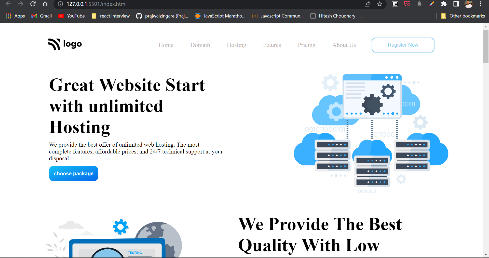

# Project-11 | HTML and CSS | Hosting Landing Page

By prajwal zingare

 

---

 

---
## What I learned from this Project
  - I learned about the grid system which i found very interesting topic not learn in depth but by building more project i will learn more about grid system.
  - I found myself more confused about use of svg but i learned how to use that
  
  ## Time required for finishing the peoject
  - It takes me near about 5 hours to complete the project.
